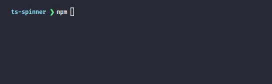

# ts-Spinner

<p align="center">
  
</p>

A beautiful, CLI spinner for use in the terminal.

## Install

Get it on [npm](https://www.npmjs.com/package/ts-spinner)

```bash
npm install ts-spinner
```

Get it on [yarn](https://yarnpkg.com/package/ts-spinner)

```bash
yarn add  ts-spinner
```

## Usage

```ts
import Spinner from "ts-spinner";

// Create spinner

const spinner = new Spinner();

// Start spinner with initial message

spinner.start("Doing something");

// Update message

spinner.update("Still doing something");

// Exit with a warning message

spinner.warning("Some warning message");

// Exit with an error message

spinner.error("Some error message");

// Exit with a success message

spinner.success("Some success message");

// Exit with a custom message (no prefix symbol)

spinner.stop("Some stop message");

// Exit without a message

spinner.stop();
```

## License

[MIT © License](LICENSE)
